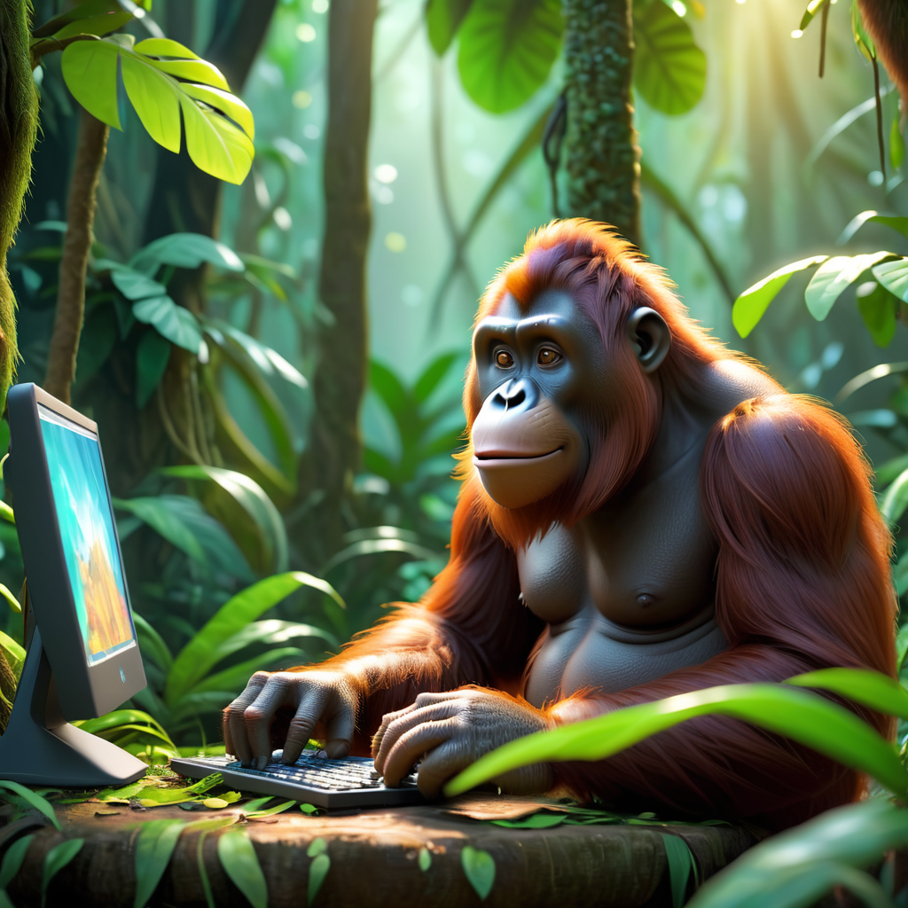
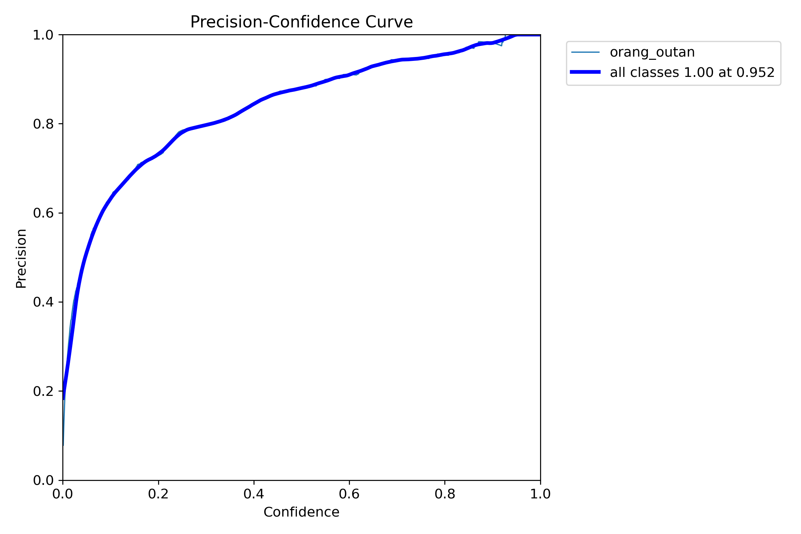
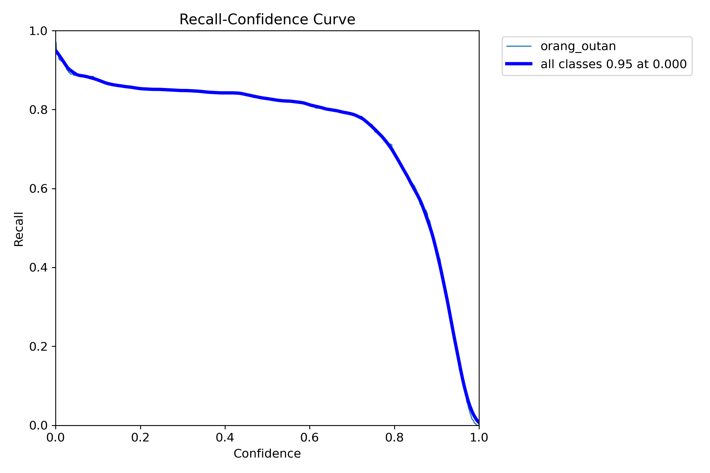
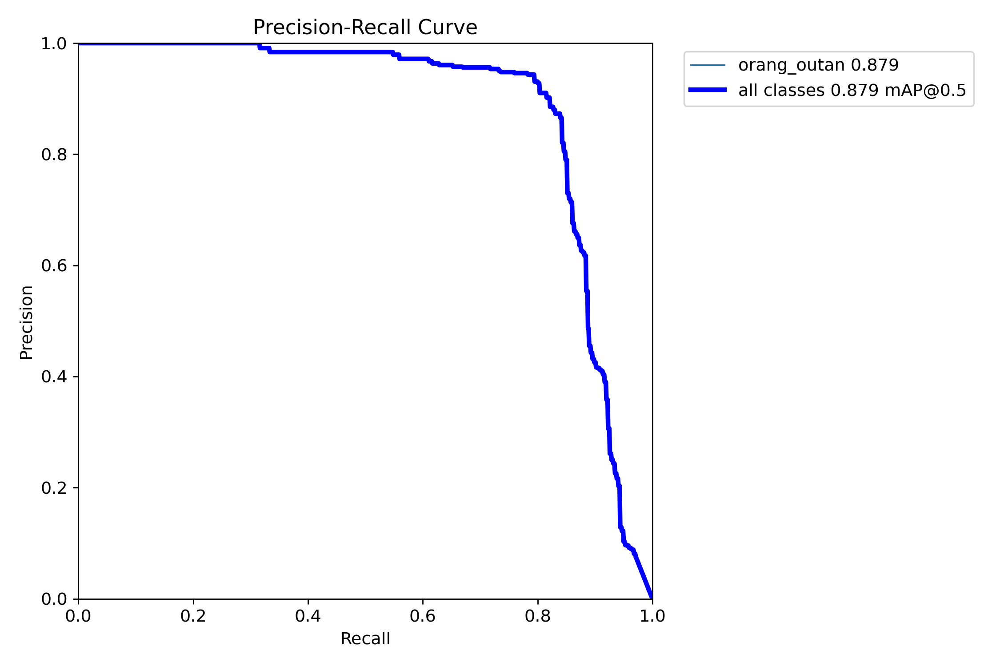
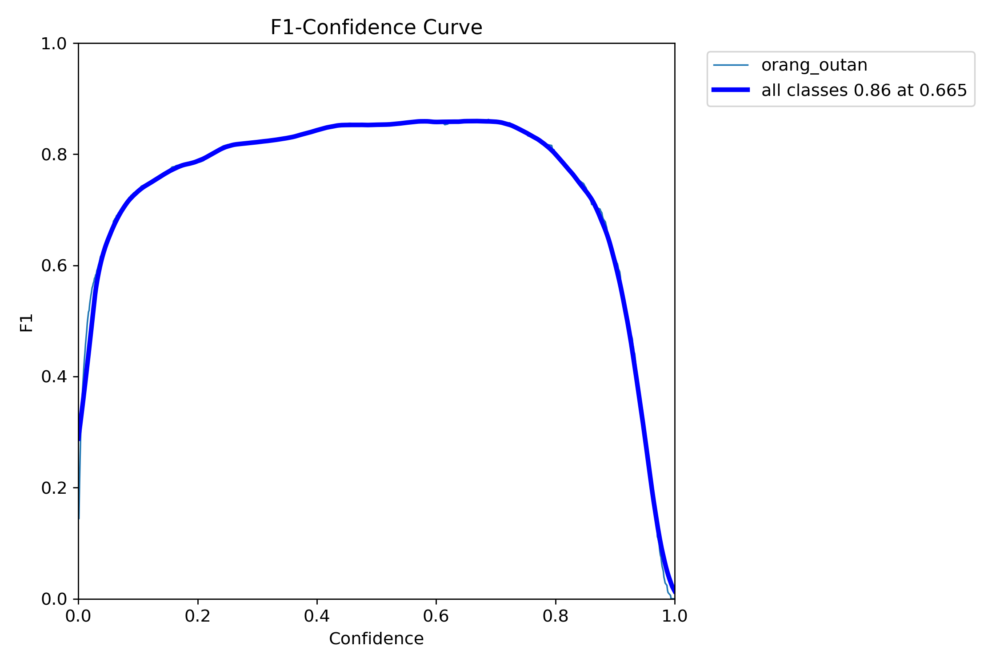

> Author: [Apavou Clément](https://github.com/clementapa)


<h1 style="text-align: center;"> WildGuardian: AI for Orangutan Ecosystem Surveillance 🦧🔍 </h1>

<p align="center">
  
</p>
<p align="center">
<em> Image generated using Stable Diffusion XL (dynavisionXL). Prompt: orangutan sitting and working on a computer in the jungle, Disney Pixar movie style, 3D render, good lightning. Negative prompt: (deformed eyes, nose, ears, nose), bad anatomy, ugly, ugly eyes. </em>
</p>

## 👁️ About the model
This is repository containing a full pipeline (from annotation to training) for building an orang outans detector.\
The model was trained using [this dataset](https://images.cv/dataset/orangutan-image-classification-dataset)
for orang outan images and [this dataset](https://www.kaggle.com/datasets/slothkong/10-monkey-species/data) as background images. Annotations were obtained using zero shot object detection method [GroundingDino](https://github.com/IDEA-Research/GroundingDINO).

My experiments are publicly available on Weights & Biases: [](https://wandb.ai/clementapa/orang_outan_detection?workspace=user-clementapa)

You can try the model on [](https://huggingface.co/spaces/Clementapa/orang-outan-image-video-detection)

<p align="center">
  
  
  
    
</p>
<p align="center">
<em> Detection results on some videos 🦧.</em>
</p>

## 😁 Good to know 

The pipeline can be used to create any type of detector. The pipeline is the following:
1. Collect images of the target class.
2. Collect negatives images that does not contain the target class, so that the model generalizes well.
3. Auto-annotate images of the target class using zero-shot object detector such as GroudingDino (```prepare_data/labelize_dataset.py``` or [](https://colab.research.google.com/drive/1iEjw1yekWZKV5feQnJeMcRuahocoSfR2?usp=sharing)).
4. Create empty annotations for negatives images (```prepare_data/create_annotation_background_image.py```).
5. Split the datasets (```prepare_data/split_data.py```).
6. Create de yaml file containing information on the data to be used during training (```data.yaml```).
7. Launch the yolo training (```train_yolov8.py```) and experiment by tuning training hyperparameters.

***If the project you're working on can contribute to wildlife conservation, don't hesitate to contact me, I'll be delighted to help. Also, during my free time, I am willing to work on projects related to wildlife conservation.***

## 🦧 About the orang outans 
Because to habitat destruction, illicit poaching, and the pet trade, orangutans are in danger of going extinct. Their natural habitat has been significantly reduced by deforestation and the growth of palm oil plantations. Adult orangutans are occasionally sought for their body parts, and they are frequently captured and sold as pets. Climate change and disease are also taking a toll on their populations. Furthermore, it is concerning to note that they are limited to Borneo and Sumatra, two places on Earth. Sustainable practises and conservation initiatives are crucial to preventing the permanent extinction of these amazing animals.

## 🌍 AI for good 
Artificial Intelligence (AI) has unquestionable power in the realm of innovation and technology. Even though artificial intelligence (AI) has frequently been used for commercial advantage, it is important to stress that AI can also be used for more noble purposes, such as protecting the environment and the planet's future. We can build a more promising and sustainable future if we reorient AI's focus from business to improving our planet.

## 🗃️ Datasets
- https://images.cv/dataset/orangutan-image-classification-dataset
- https://www.kaggle.com/datasets/slothkong/10-monkey-species/data
- https://www.kaggle.com/datasets/utkarshsaxenadn/10-species-of-monkey-multiclass-classification (not used for training)

## 🐒 Models released

| model |training name | data train | data validation | checkpoint | Experiment |
|----------|----------|--------|------------------------|------------------------|------------------------|
| YOLOv8n | train7 | 1085 images of orang outans & 1095 images of other monkeys | 272 images of orang outans & 274 images of other monkeys | [](https://wandb.ai/clementapa/orang_outan_detection/artifacts/model/run_wrec3egu_model/v0) | [](https://wandb.ai/clementapa/orang_outan_detection/runs/wrec3egu?workspace=user-clementapa) |

### 📈 Metrics train 7 

<p align="center">
  
  
  
  
</p>
<p align="center">
<em> Validation metrics for the train 7, other metrics are available on the wandb experiment.</em>
</p>